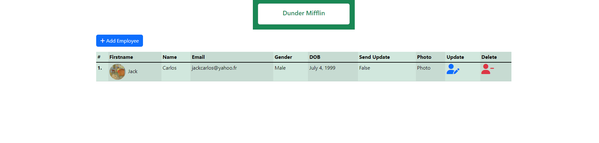

# CRUD_Operation_in_Django


settings.py:
````python
"""
Django settings for mysite project.

Generated by 'django-admin startproject' using Django 4.1.3.

For more information on this file, see
https://docs.djangoproject.com/en/4.1/topics/settings/

For the full list of settings and their values, see
https://docs.djangoproject.com/en/4.1/ref/settings/
"""

from pathlib import Path

# Build paths inside the project like this: BASE_DIR / 'subdir'.
BASE_DIR = Path(__file__).resolve().parent.parent


# Quick-start development settings - unsuitable for production
# See https://docs.djangoproject.com/en/4.1/howto/deployment/checklist/

# SECURITY WARNING: keep the secret key used in production secret!
SECRET_KEY = 'django-insecure-!e6jdd2-4&bx#e6ef9vez^rszl9m*37#(j*!yg9m)%^jcbq!+k'

# SECURITY WARNING: don't run with debug turned on in production!
DEBUG = True

ALLOWED_HOSTS = []


# Application definition

INSTALLED_APPS = [
    'django.contrib.admin',
    'django.contrib.auth',
    'django.contrib.contenttypes',
    'django.contrib.sessions',
    'django.contrib.messages',
    'django.contrib.staticfiles',
    'crispy_forms',
    'webapp'
]

MIDDLEWARE = [
    'django.middleware.security.SecurityMiddleware',
    'django.contrib.sessions.middleware.SessionMiddleware',
    'django.middleware.common.CommonMiddleware',
    'django.middleware.csrf.CsrfViewMiddleware',
    'django.contrib.auth.middleware.AuthenticationMiddleware',
    'django.contrib.messages.middleware.MessageMiddleware',
    'django.middleware.clickjacking.XFrameOptionsMiddleware',
]

ROOT_URLCONF = 'mysite.urls'

TEMPLATES = [
    {
        'BACKEND': 'django.template.backends.django.DjangoTemplates',
        'DIRS': ['templates'],
        'APP_DIRS': True,
        'OPTIONS': {
            'context_processors': [
                'django.template.context_processors.debug',
                'django.template.context_processors.request',
                'django.contrib.auth.context_processors.auth',
                'django.contrib.messages.context_processors.messages',
            ],
        },
    },
]

WSGI_APPLICATION = 'mysite.wsgi.application'


# Database
# https://docs.djangoproject.com/en/4.1/ref/settings/#databases

DATABASES = {
    'default': {
        'ENGINE': 'django.db.backends.sqlite3',
        'NAME': BASE_DIR / 'db.sqlite3',
    }
}


# Password validation
# https://docs.djangoproject.com/en/4.1/ref/settings/#auth-password-validators

AUTH_PASSWORD_VALIDATORS = [
    {
        'NAME': 'django.contrib.auth.password_validation.UserAttributeSimilarityValidator',
    },
    {
        'NAME': 'django.contrib.auth.password_validation.MinimumLengthValidator',
    },
    {
        'NAME': 'django.contrib.auth.password_validation.CommonPasswordValidator',
    },
    {
        'NAME': 'django.contrib.auth.password_validation.NumericPasswordValidator',
    },
]


# Internationalization
# https://docs.djangoproject.com/en/4.1/topics/i18n/

LANGUAGE_CODE = 'en-us'

TIME_ZONE = 'UTC'

USE_I18N = True

USE_TZ = True


# Static files (CSS, JavaScript, Images)
# https://docs.djangoproject.com/en/4.1/howto/static-files/

STATIC_URL = 'static/'

# Default primary key field type
# https://docs.djangoproject.com/en/4.1/ref/settings/#default-auto-field

DEFAULT_AUTO_FIELD = 'django.db.models.BigAutoField'

STATIC_ROOT = BASE_DIR / 'staticfiles'
STATICFILES_DIRS = [
    BASE_DIR / 'static',
]
MEDIA_ROOT = BASE_DIR / 'media'
MEDIA_URL = '/media/'

CRISPY_TEMPLATE_PACK = 'bootstrap4'

````
models.py:
````python
from django.db import models

# Create your models here.
choices2 = (('I','Infra'),('IO','In/out'),('W','Web'),('R','RPG'),('S','Support'),('R','RH'),('E','Exploitation'))
class Employee(models.Model):
    firstname = models.CharField(max_length=100)
    name = models.CharField(max_length=100)
    position = models.CharField(max_length=100)
    category = models.CharField(choices=choices2,max_length=20)
    email = models.EmailField(max_length=150)
    gender = models.CharField(choices=(('M','Male'),('F','Female')),max_length=20)
    date_of_birth = models.DateField()
    send_update = models.BooleanField(default=False)
    photo = models.FileField(upload_to='profile')

    def __str__(self) -> str:
        return self.name
````

views.py:
````python
from django.shortcuts import render
from django.views.generic import CreateView,UpdateView,ListView,DeleteView
from webapp.models import Employee
from webapp.forms import EmployeeModelForm

# Create your views here.
class EmployeeListView(ListView):
    model = Employee
    template_name = 'home.html'
    context_object_name = 'employee_list'
    success_url = '/'


class EmployeeCreateView(CreateView):
    model = Employee
    form_class = EmployeeModelForm
    template_name = 'employee_form.html'
    success_url = '/'


class EmployeeUpdateView(UpdateView):
    model=Employee
    form_class = EmployeeModelForm
    template_name = 'employee_form.html'
    success_url = '/'


class EmployeeDeleteView(DeleteView):
    model = Employee
    success_url = '/'

    def get(self,request, *args, **kwargs):
        return self.delete(request,*args, **kwargs)
````
mysite/urls.py:
````python
from django.contrib import admin
from django.urls import path,include
from django.conf.urls.static import static
from mysite import settings

urlpatterns = [
    path('admin/', admin.site.urls),
    path('',include('webapp.urls')),
]+ static(settings.STATIC_URL,document_root=settings.STATIC_ROOT) + static(settings.MEDIA_URL,document_root=settings.MEDIA_ROOT)
````
webapp/urls.py:
````python
from django.urls import path
from webapp.views import EmployeeCreateView,EmployeeListView,EmployeeUpdateView,EmployeeDeleteView

urlpatterns = [
    path('', EmployeeListView.as_view(),name='list'),
    path('create', EmployeeCreateView.as_view(),name='create'),
    path('update/<int:pk>/',EmployeeUpdateView.as_view(),name='update'),
    path('delete/<int:pk>/',EmployeeDeleteView.as_view(),name='delete')

]
````
home.html
````html




<div class="container mx-auto p-2 mt-2">
    <ul class="list-inline">
        <li class="list-inline-item">
            <a href="" class="btn btn-primary"><i class="fa-sharp fa-solid fa-plus"></i>&nbsp;Add Employee</a>
        </li>
    </ul>

    <table class="table table-sm table-success table-striped-columns">
        <thead>
            <tr>
              <th scope="col">#</th>
              <th scope="col">Firstname</th>
              <th scope="col">Name</th>
              <th scope="col">Email</th>
              <th scope="col">Gender</th>
              <th scope="col">DOB</th>
              <th scope="col">Send Update</th>
              <th scope="col">Photo</th>
              <th scope="col">Update</th>
              <th scope="col">Delete</th>

            </tr>
        </thead>
        <tbody class="table-group-divider">
            
            <tr>
              <th scope="row">{{forloop.counter}}.</th>
              <td>&nbsp;&nbsp;{{employee.firstname}}</td>
              <td>{{employee.name}}</td>
              <td>{{employee.email}}</td>
              <td>{{employee.get_gender_display}}</td>
              <td>{{employee.date_of_birth}}</td>
              <td>{{employee.send_update}}</td>
              <td>Photo</td>
              <td><a href=""><i class="fa-solid fa-user-pen fa-2x"></i></a></td>
              <td><a href="#employeeModel{{employee.pk}}" data-bs-target="#employeeModel{{employee.pk}}" data-bs-toggle="modal"><i class="fa-solid fa-user-minus text-danger fa-2x"></i></a></td>
            </tr>

            <div class="modal fade" id="employeeModel{{employee.pk}}" aria-hidden="true" aria-labelledby="employeeModalToggleLabel" tabindex="-1">
                <div class="modal-dialog">
                  <div class="modal-content">
                    <div class="modal-header">
                      <div>
                        <h1 class="modal-title fs-5" id="exampleModalToggleLabel">Are you sure, you want to delete {{employee.name}}'s detail ?</h1>
                        <ul class="list-inline text-end">
                            <li class="list-inline-item">
                                <button type="button" class="btn btn-secondary" data-bs-dismiss="modal">Close</button>
                            </li>
                            <li class="list-inline-item">
                                <a href="" class="btn btn-danger">Delete</a>
                            </li>
                          </ul>
                      </div>

                    </div>
                  </div>
                </div>
              </div>

            
        </tbody>
    </table>
</div>


````

